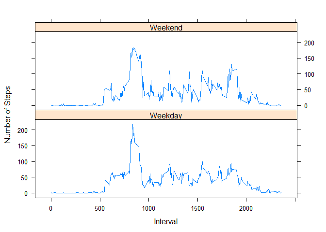

## Code for reading in the dataset


```r
datawithNA <- read.csv("activity.csv")
```


## Histogram of the total number of steps taken each day


```r
NA_index <- is.na(datawithNA$steps)
datawithoutNA <- datawithNA[!NA_index,]


steps_each_day <- aggregate(steps ~ date, data = datawithoutNA, sum)
hist(steps_each_day$steps, xlab = "Number of Steps", main= "Histogram of the total number of steps taken each day")
```

<!-- -->
 
## Mean and median number of steps taken each day

```r
MeanSteps<- mean(steps_each_day$steps)
MedianSteps<- median(steps_each_day$steps)
```

The mean number of steps taken each day is 10766. 
The median number of steps taken each day is 10765.


## Time series plot of the average number of steps taken

```r
steps_per_interval <- aggregate(datawithoutNA$steps, by=list(datawithoutNA$interval), FUN=mean)
colnames(steps_per_interval) <- c("interval", "average_steps")

plot(steps_per_interval$interval, steps_per_interval$average_steps, type="l", xlab = "Interval", ylab = "Average Number of Steps", main = "Average Daily Activity Pattern")
```

<!-- -->

## The 5-minute interval that, on average, contains the maximum number of steps

```r
MaxSteps<- max(steps_per_interval$average_steps)
MaxStepsInterval<- steps_per_interval$interval[steps_per_interval$average_steps==max(steps_per_interval$average_steps)]
```

The maximum number of steps in any interval is 206.1698113.
This occurs in the interval 835.


## Code to describe and show a strategy for imputing missing data

Missing values replace by the mean value


```r
MissingValue<- function(row){ if(is.na(datawithNA$steps[row])) {steps_per_interval$average_steps[steps_per_interval$interval==datawithNA$interval[row]]} else datawithNA$steps[row]}
CorrectedData<- datawithNA
CorrectedData$steps<- sapply(1:nrow(datawithNA),MissingValue)
```

## Histogram of the total number of steps taken each day after missing values are imputed


```r
Corrected_steps_each_day <- aggregate(steps ~ date, data = CorrectedData, sum)
hist(Corrected_steps_each_day$steps, xlab = "Number of Steps", main= "Histogram of the total number of steps taken each day")
```

<!-- -->


```r
NewMeanSteps<- mean(Corrected_steps_each_day$steps)
NewMedianSteps<- median(Corrected_steps_each_day$steps)
```

The mean number of steps taken each day is 10766. 
The median number of steps taken each day is 1.0766189\times 10^{4}.

## Panel plot comparing the average number of steps taken per 5-minute interval across weekdays and weekends


```r
CorrectedData$Weekday<-sapply(as.Date(CorrectedData$date), weekdays)
Weekend<- function(day) {if(day %in% c("Saturday","Sunday")){"Weekend"} else "Weekday"}
CorrectedData$DayType<-sapply(CorrectedData$Weekday, Weekend)

Corrected_steps_per_interval <- aggregate(CorrectedData$steps, by=list(CorrectedData$interval,CorrectedData$DayType), FUN=mean)
colnames(Corrected_steps_per_interval) <- c("interval","DayType","steps")


library(lattice)
xyplot(steps~interval|factor(DayType), data= Corrected_steps_per_interval,
       type='l',layout=c(1,2),
       xlab='Interval',ylab='Number of Steps')
```

<!-- -->


